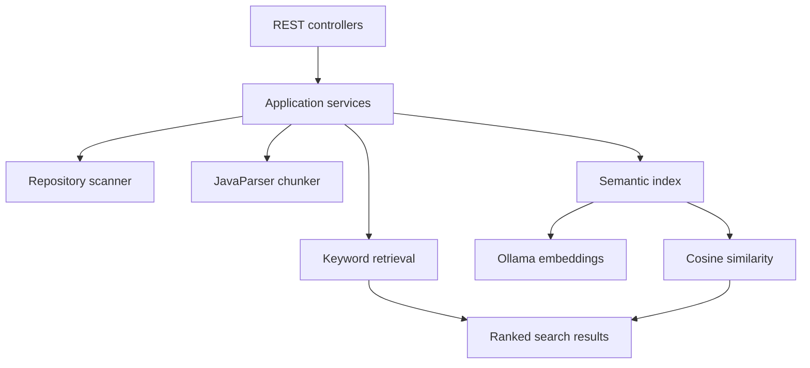

# RepoLens

RepoLens is a Spring Boot application for searching Java repositories by keyword or semantic meaning. It scans Java source files, uses JavaParser to extract methods as searchable chunks, and can rank those chunks with either weighted keyword matching or embeddings generated by a local Ollama model.

> **Project status:** Paused at a working semantic-search prototype. The current application is usable locally, but persistent vector storage, generated RAG answers, repository cloning, and a frontend have not yet been implemented.

## What RepoLens Does

RepoLens currently supports the following workflow:

1. Scan a configured local directory for `.java` files.
2. Read each source file and parse it with JavaParser.
3. Extract individual methods with their class names, filenames, and line ranges.
4. Search the extracted methods using either:
   - weighted keyword matching; or
   - semantic similarity using Ollama embeddings.
5. Return ranked results through a REST API.

RepoLens performs retrieval only. It does not yet send retrieved code to a generative model to produce natural-language answers.

## Technology Stack

- Java 21
- Spring Boot 3.5
- Maven and Maven Wrapper
- JavaParser
- Ollama
- `embeddinggemma`
- JUnit 5
- Mockito
- MockMvc

## Architecture



Important design decisions include:

- `RepositoryScanner` is an interface, while `FileSystemRepositoryScanner` is its current implementation.
- `EmbeddingProvider` is an interface, while `OllamaEmbeddingProvider` is the current implementation.
- Controllers handle HTTP requests and delegate application work to services.
- API DTOs are separate from internal model classes.
- Exceptions are converted into consistent HTTP responses by `GlobalExceptionHandler`.
- The semantic index is cached in memory and rebuilt only when requested or when a different repository is used.

## Prerequisites

Install the following before running RepoLens:

- JDK 21
- Ollama
- Git

The Maven Wrapper is included, so a separate Maven installation is not required.

## Getting Started

### 1. Clone the repository

```bash
git clone https://github.com/dando985/repolens.git
cd repolens
```

### 2. Download the embedding model

```bash
ollama pull embeddinggemma
```

Make sure Ollama is running before using semantic search or the Ollama health endpoint.

### 3. Configure the repository

The default configuration is in `src/main/resources/application.properties`:

```properties
spring.application.name=repolens

repolens.repository.path=sample-project

repolens.ollama.base-url=http://localhost:11434
repolens.ollama.embedding-model=embeddinggemma
```

`repolens.repository.path` may be a relative or absolute path. Relative paths are resolved from the directory in which RepoLens is started.

To scan another repository, change the property to an absolute path, for example:

```properties
repolens.repository.path=C:/projects/my-java-application
```

### 4. Run the application

Windows PowerShell:

```powershell
.\mvnw.cmd spring-boot:run
```

macOS or Linux:

```bash
./mvnw spring-boot:run
```

The API starts at:

```text
http://localhost:8080
```

## API Endpoints

### Application health

```http
GET /api/health
```

Confirms that the Spring Boot application is running. It does not contact Ollama.

Example response:

```json
{
  "status": "UP",
  "application": "RepoLens"
}
```

### Ollama health

```http
GET /api/health/ollama
```

Creates a real test embedding and reports the configured model and vector dimensions.

### Scan the repository

```http
GET /api/repository/scan
```

Returns the Java files discovered under the configured repository path.

### List parsed methods

```http
GET /api/repository/methods
```

Returns the class and method names extracted by JavaParser.

### Keyword search

```http
GET /api/search/keyword?query=add%20numbers&limit=5
```

Keyword scoring currently uses these weights:

| Match location | Score |
|---|---:|
| Method name | +3 |
| Class name | +2 |
| Method content | +1 |

### Semantic search

```http
GET /api/search/semantic?query=method%20that%20combines%20numbers&limit=5
```

On the first semantic request, RepoLens embeds every method in the configured repository. It embeds the query, calculates cosine similarity against each method vector, and returns the closest matches.

Example response:

```json
{
  "query": "method that combines numbers",
  "resultCount": 1,
  "results": [
    {
      "score": 0.82,
      "file": "Calculator.java",
      "className": "Calculator",
      "methodName": "add",
      "startLine": 3,
      "endLine": 5,
      "content": "public int add(int first, int second) { ... }"
    }
  ]
}
```

### Rebuild the semantic index

```http
POST /api/index/semantic/rebuild
```

Forces RepoLens to rescan the repository and regenerate every embedding. Use this after modifying source files because the current in-memory cache does not automatically detect file changes.

## HTTP Error Responses

Errors use a consistent JSON structure:

```json
{
  "error": "Invalid search request",
  "details": "Limit must be between 1 and 20"
}
```

| Situation | Status |
|---|---:|
| Invalid query or limit | `400 Bad Request` |
| Repository directory not found | `404 Not Found` |
| Repository I/O failure | `500 Internal Server Error` |
| Ollama or embedding failure | `502 Bad Gateway` |

## Running Tests

Windows:

```powershell
.\mvnw.cmd test
```

macOS or Linux:

```bash
./mvnw test
```

The test suite covers:

- Recursive Java-file scanning
- JavaParser method chunking
- Keyword scoring and ranking
- Cosine similarity
- Semantic retrieval and result limits
- Embedding-index creation
- Semantic-index caching and rebuilding
- Service orchestration
- Controller routing, JSON responses, and error handling

## Building an Executable JAR

Windows:

```powershell
.\mvnw.cmd clean package
java -jar target\repolens-1.0-SNAPSHOT.jar
```

macOS or Linux:

```bash
./mvnw clean package
java -jar target/repolens-1.0-SNAPSHOT.jar
```

## Project Structure

```text
src/
├── main/
│   ├── java/com/dando/repolens/
│   │   ├── chunking/      JavaParser method extraction
│   │   ├── config/        Repository and Ollama configuration
│   │   ├── controller/    REST endpoints
│   │   ├── dto/           API response objects
│   │   ├── embedding/     Embedding provider and indexing
│   │   ├── exception/     Application exceptions and HTTP handling
│   │   ├── model/         Internal domain objects
│   │   ├── retrieval/     Keyword and semantic ranking
│   │   ├── scanner/       Repository scanning abstraction
│   │   └── service/       Application workflows and index lifecycle
│   └── resources/
│       └── application.properties
└── test/
    └── java/com/dando/repolens/
        ├── chunking/
        ├── controller/
        ├── embedding/
        ├── retrieval/
        ├── scanner/
        └── service/
```

The `sample-project` directory contains small Java files for local development and manual API testing.

## Current Limitations

- Only Java repositories are supported.
- Only methods are extracted; constructors and other declaration types are not indexed.
- The semantic index is stored only in memory and is lost when the application stops.
- Similarity search performs a linear scan over all embedded chunks.
- Repository changes do not automatically invalidate the semantic index.
- Search responses currently return filenames rather than unique repository-relative paths.
- Ollama must be available for semantic indexing and search.
- The API operates on one configured local repository.
- There is no authentication, frontend, Git repository cloning, or generated RAG answer yet.

## Where to Resume Development

The next planned phase was persistent vector storage and complete RAG answering:

1. Add PostgreSQL and pgvector with Docker Compose.
2. Create database entities and migrations for repositories, source files, chunks, and embeddings.
3. Replace the in-memory semantic index with vector similarity queries in PostgreSQL.
4. Detect changed files and regenerate only stale embeddings.
5. Return repository-relative source paths for unambiguous citations.
6. Add a generation provider that sends the question and retrieved chunks to an LLM.
7. Produce natural-language answers with file, class, method, and line citations.
8. Add JGit for cloning and refreshing remote repositories.
9. Add a frontend for repository selection, search, and cited answers.
10. Add authentication, Docker packaging, and CI.

## Intended Final Workflow

```text
Repository
    → scan Java files
    → parse methods
    → create embeddings
    → store vectors
    → retrieve relevant methods
    → generate an answer
    → cite source files and line ranges
```

RepoLens is primarily a learning project demonstrating Spring Boot architecture, dependency injection, source-code parsing, embeddings, semantic retrieval, REST API design, and automated testing.
